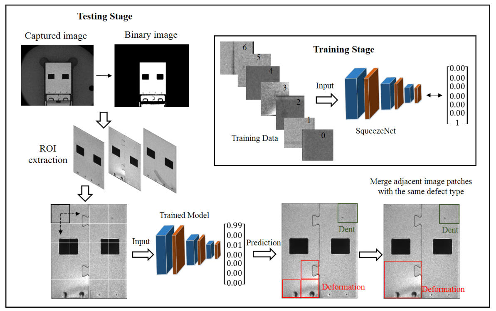

# A-Deep-Learning-Based-Surface-Defect-Inspection-System-Using-Multiscale-and-Channel-Compressed-

By  Jiangxin Yang, Guizhong Fu, Wenbin Zhu,, Yanlong Cao, Yanpeng Cao, Michael Ying Yang.

Cite us using:

Yang J, Fu G, Zhu W, et al. A deep learning-based surface defect inspection system using multiscale and channel-compressed features[J]. IEEE transactions on instrumentation and measurement, 2020, 69(10): 8032-8042.

The paper is available at  |[`[PDF Download]`](https://ieeexplore.ieee.org/abstract/document/9063543/)

### Introduction
Industrial workpieces commonly contain complex structures, including hallow regions, welding joints, or rivet holes. Such obvious structural interference will inevitably cause a cluttered background and mislead the classification results. Moreover, the sizes of various surface defects might change significantly. Last but not least, it is extremely time-consuming and not scalable to capture large-scale defect data sets to train deep CNN models. To address the challenges mentioned earlier, we first proposed to incorporate multiple convolutional layers with different kernel sizes to increase the receptive field and to generate multiscale features. The proposed model can better handle the cluttered background.
and defects of various sizes.

### Multi-light source illumination Dataset
Google Drive: https://drive.google.com/file/d/1AKqfTXPVBcRyLawUdqcCtv2eGSv6wHU0/view?usp=sharing

Baidu Cloud: https://pan.baidu.com/s/1j03nlOtiG1z8N5vsE0HAYQ?pwd=qak7  Password：qak7 

### Contact
If you have any questions, feel free to contact:
- Guizhong Fu (fuguizhongchina@163.com)
